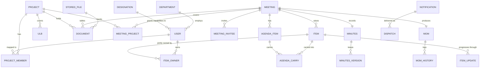

# 02 · Data model

`prisma/schema.prisma` is the executable version of this document. Change both together.

## Entity relationships



## The decisions worth explaining

**One `items` table, two shapes.** Actions and clarifications share a table with a `type` discriminator, because they share a lifecycle position (raised in a meeting, activated on circulation, carried forward), a register, a set of filters and an export. What differs is which columns are meaningful:

| | Action | Clarification |
|---|---|---|
| owners (many) | required, ≥ 1 | must be empty |
| dueDate | required | must be null |
| priority | optional | must be null |
| actionStatus | required | must be null |
| respondedById | must be null | optional |
| clarificationStatus | must be null | required |

Enforced twice: a zod discriminated union at the API edge, and a CHECK constraint in the first migration so bad rows cannot exist even if a service is wrong.

```sql
ALTER TABLE items ADD CONSTRAINT items_shape CHECK (
  (type = 'ACTION'        AND due_date IS NOT NULL AND action_status IS NOT NULL
                          AND responded_by_id IS NULL AND clarification_status IS NULL)
  OR
  (type = 'CLARIFICATION' AND due_date IS NULL AND action_status IS NULL
                          AND priority IS NULL AND clarification_status IS NOT NULL)
);
```

**`item_owners` has no "primary" column.** Joint ownership was an explicit decision: every owner is equally accountable. Adding a primary flag later would be a scope change, not a refinement.

**`activatedAt` is the hinge.** It is null from creation until the signed MoM is circulated. Every query that drives a dashboard count, a reminder or an escalation filters on `activatedAt IS NOT NULL`. Everything that drives the meeting's own item list does not.

**Capabilities live on the designation as a `String[]`**, not a join table. There are sixteen of them and they are read on every request; an array column with a GIN index beats a join, and the editable matrix is a single row update.

**Audit is append-only at the database level**, not by convention:

```sql
CREATE RULE audit_no_update AS ON UPDATE TO audit_entries DO INSTEAD NOTHING;
CREATE RULE audit_no_delete AS ON DELETE TO audit_entries DO INSTEAD NOTHING;
```

**Notification and dispatch are separate.** One notification event fans out to one dispatch row per recipient per channel. Delivery state, retries and provider ids belong to the dispatch; the event, template and payload belong to the notification. Webhooks update dispatches without touching the event record.

**Money is `Decimal(14,2)`** and expressed in ₹ crore. Dates that are dates use `@db.Date`; instants use `timestamptz`. Times of day are `VARCHAR(5)` `HH:mm` because a meeting start time is a wall-clock intent, not an instant.

## Reference codes

| Object | Format | Issued |
|---|---|---|
| Meeting | `UCF/<scope>/<RM\|IM>-nn` — scope is the project code, `HO` when it covers more than one | on create, never reused |
| Action | `ACT-nn` | on create, per type sequence |
| Clarification | `CLA-nn` | on create, per type sequence |
| Document | `D-nnn` project, `MD-nnn` meeting | on create |

Sequences are per-tenant global, allocated in a transaction. Codes never change, never get reused, and survive cancellation.

## Indexes that matter

`meetings(meeting_date)`, `meetings(stage)`, `items(project_id)`, `items(action_status)`, `items(clarification_status)`, `items(due_date)`, `item_owners(user_id)`, `dispatches(state)`, `audit_entries(object_type, object_id)`, `audit_entries(created_at)`, and a GIN index on `designations(caps)`.

The register at 50,000 items is the load case to test: it filters on type, status, project, owner and free text simultaneously.

## Seed data

`prisma/seed.ts` loads the dataset the prototype ships with, so the built application and the prototype show the same numbers side by side: 3 projects, 6 ULBs, 9 designations, 14 users, 7 meetings across both types and every MoM state, 19 items, 9 documents. The fixed clock is **1 September 2026** — keep it, or the ageing and calendar states drift and every screenshot in the docs stops matching.
