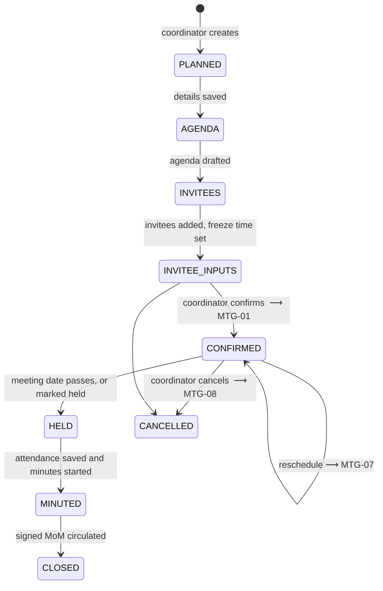
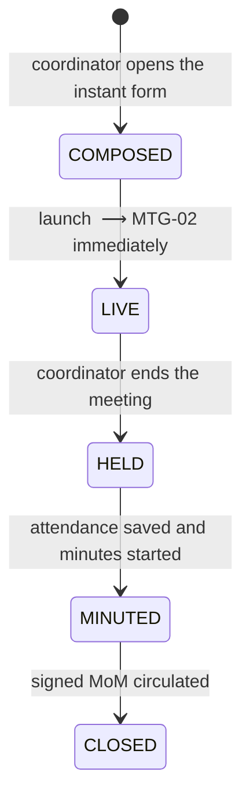
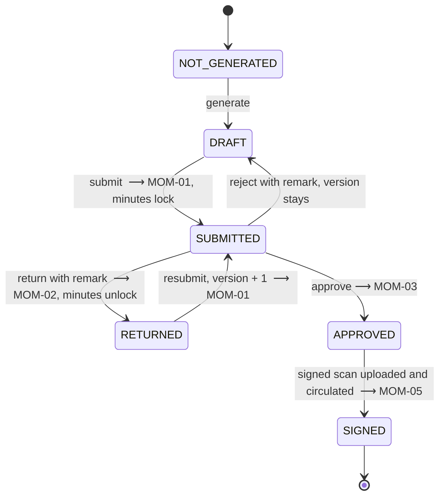
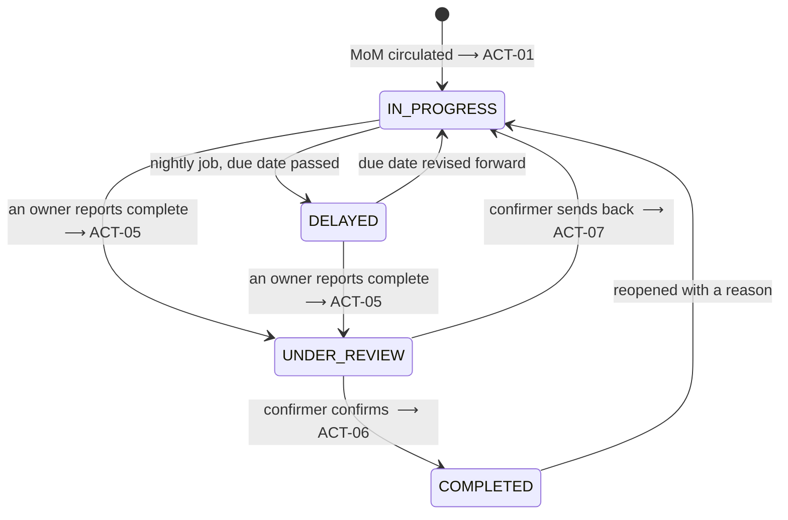
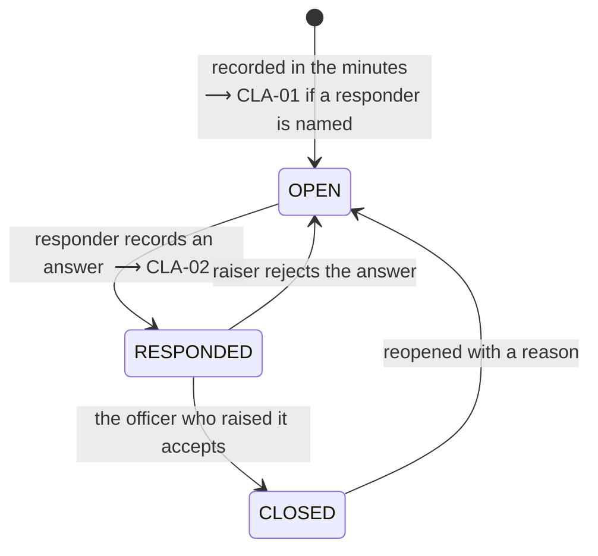

# 05 · Workflows and state machines

Four state machines. Every transition here is the complete set — a transition not listed does not exist, and the API must reject it with `409 INVALID_TRANSITION`.

---

## 1 · Meeting — scheduled

Guards:

- `confirm` requires `confirm_meeting`, at least one agenda item, at least one invitee, and a chairperson.
- **Confirmation is the Meeting Coordinator's, not an executive's.** There is no approval gate on a meeting.
- After `CONFIRMED` the agenda is frozen: `POST /agenda-items` returns `409 AGENDA_FROZEN`.
- Before `CONFIRMED`, invitees may add agenda items until `agendaFreezeAt`. After the freeze and before confirmation, the agenda is read-only for invitees but still editable by the coordinator.
- `reschedule` keeps the code and the agenda, writes an audit entry with the reason, and re-notifies.
- `cancel` requires a reason. A cancelled meeting keeps its record; it never disappears.

## 2 · Meeting — instant

- No agenda circulation, no RSVP, no freeze. `agendaFreezeAt` stays null.
- `launch` requires only a title, one project and one invitee. Everything else may be filled later.
- The meeting is stamped `type = INSTANT` and every downstream surface — register, MoM header, exports — shows it, because a reader must know the agenda was never circulated.
- From `HELD` onward, instant and scheduled meetings are identical.

## 3 · MoM

Guards and effects:

- `generate` requires attendance recorded for **every** invitee and minutes present.
- `submit` requires every action to have at least one owner and a due date; it sets `minutes.lockedAt`.
- `approve` requires `approve_mom`. A remark is mandatory on `return` and `reject`, optional on `approve`.
- `sign` requires `upload_signed`, a PDF, and a match on page count and action-table row count against the approved draft; a mismatch is `422 SIGNED_MOM_MISMATCH`.
- **Circulation is the hinge.** On `SIGNED`:
  1. every `Item` for that meeting gets `activatedAt = now()`;
  2. `ACT-01` fires once per responsible officer;
  3. `MOM-05` fires to all invitees plus standing recipients;
  4. the meeting moves to `CLOSED`.
- A `SIGNED` MoM is immutable. A correction creates a **new MoM row** with `correctsMomId` pointing at the original, going through the same cycle. Never mutate a circulated MoM.

## 4 · Action item

- Before `activatedAt` the item exists but has **no status transitions and no notifications**. It shows as *Not yet active*.
- **Joint ownership.** Every officer in `item_owners` is equally accountable. Any one may report complete; the confirmation applies to the item as a whole; reminders go to all of them.
- **Nobody confirms their own work.** `confirmerId != any(owners)` — enforced in the service, not just the UI.
- `DELAYED` is set by the nightly job at 00:05 for `IN_PROGRESS` items past due. An item already `UNDER_REVIEW` that passes its due date **keeps that status** and is reported as *overdue, awaiting confirmation* — it is waiting on the confirmer, not on the work.
- **Priority routing is an open decision.** Implement `resolveConfirmers(item): DesignationId[]` in `items/confirmation.policy.ts`. Ship it returning the single default confirming designation for every priority, with the priority switch stubbed and commented. Do not invent the matrix.
- Escalation: 15 days overdue → Project Director (`ACT-08`); 30 days → Mission Director.
- Reopening a `COMPLETED` item requires `confirm_completion` and a mandatory reason.

## 5 · Clarification

- Deliberately a **separate vocabulary** from actions so the two dashboard charts read side by side.
- No due date, no priority, no owners — one nominated responder.
- Also activated by MoM circulation.
- A clarification open beyond 14 days triggers `CLA-03`.

## 6 · Carry-forward

When a new scheduled meeting is planned, the coordinator may pull forward every open item for the projects it covers:

- eligible = `activatedAt != null` AND (`actionStatus != COMPLETED` OR `clarificationStatus != CLOSED`) AND project in the new meeting's projects;
- selected items are written to `agenda_carries` under an auto-created `AgendaItem` with `ordinal = 0`, `isCarryBlock = true`, undeletable;
- `item.carryCount` increments;
- a **revised due date is mandatory** on any action with `carryCount >= 2`, validated on save;
- the carry block appears as section 3 of the generated MoM.

## 7 · Scheduled jobs

| Job | Cadence | Effect |
|---|---|---|
| `mark-delayed` | 00:05 daily | `IN_PROGRESS` past due → `DELAYED`, emits `ACT-04` |
| `due-reminders` | 09:00 daily | `ACT-02` at T−3, `ACT-03` at T−0 |
| `escalations` | 00:20 daily | `ACT-08` at 15 and 30 days overdue |
| `clarification-ageing` | 09:00 daily | `CLA-03` beyond 14 days open |
| `mom-sla` | 09:00 daily | `MOM-04` where `SUBMITTED` older than 3 days |
| `agenda-freeze` | hourly | closes invitee contributions, emits `MTG-04` at T−24h |
| `meeting-reminders` | hourly / 15 min | `MTG-05` at T−24h, `MTG-06` at T−2h |
| `weekly-digest` | Mon 08:00 | `RPT-01` |
| `dispatch-retry` | every 5 min | retries `FAILED` dispatches under three attempts |

All jobs are idempotent and safe to re-run; each records what it did in the audit log with `actorId = null`.
